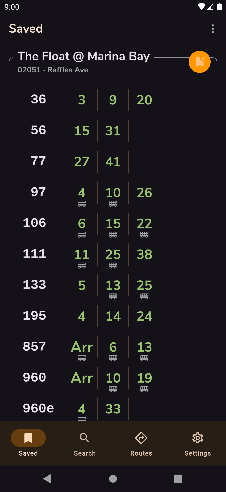
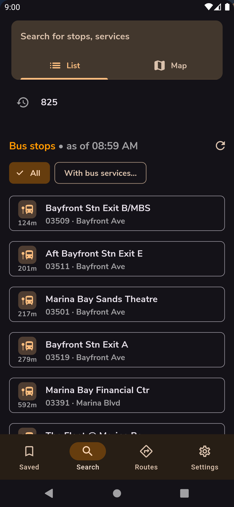
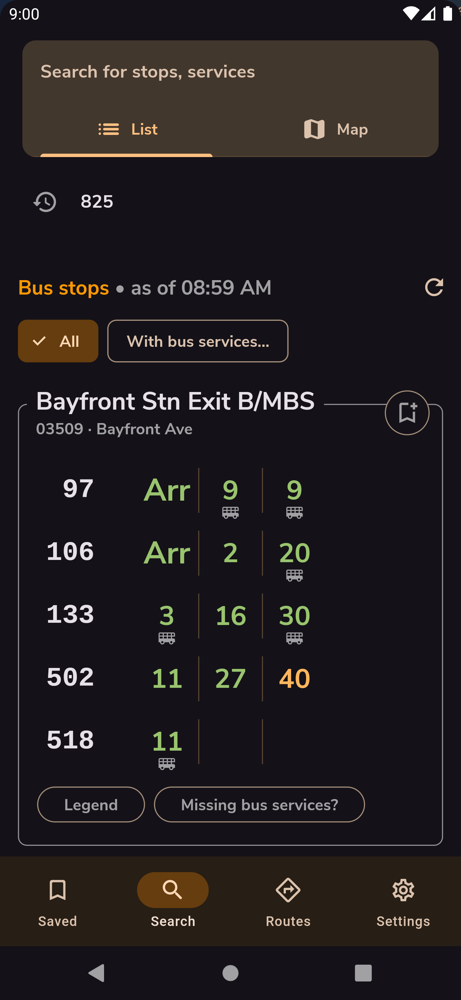
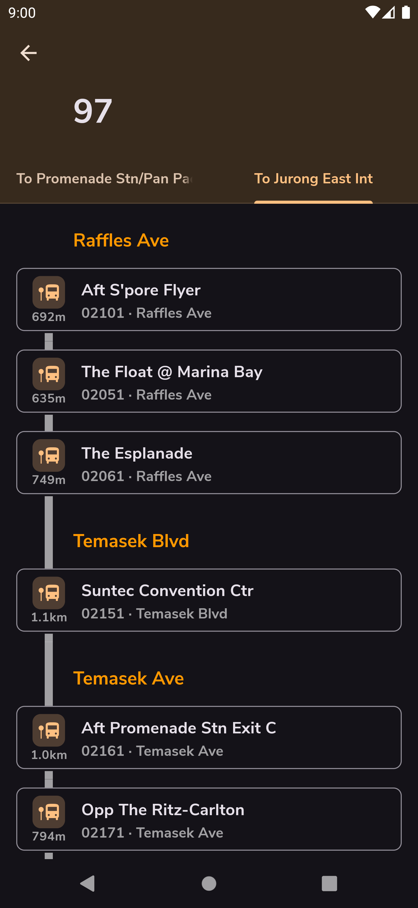

Stops is an app built with Flutter that displays live bus timings for bus stops in Singapore.
It uses live data exposed by [LTA Datamall](https://www.mytransport.sg/content/mytransport/home/dataMall.html)'s API.

## Download (Android)

<a href="https://play.google.com/store/apps/details?id=com.jeffsieu.stops">
 
</a>

Or check out the [releases page](https://github.com/jeffsieu/stops-flutter/releases).

## Features
 - Simplistic design inspired by Material Design 3
 - Save your favorite bus stops
 - Search bus stops by their name or code
 - Rename bus stops as you wish
 - Light/dark mode options
 - Add routes to easily organize bus stops you frequent


## Screenshots

<p align="middle">
 
 
 
 
</p>


## Getting Started
 ```
 git clone https://github.com/jeffsieu/stops-flutter.git
 ```
 
### Setting API keys
Set your [Google Maps API key](https://console.cloud.google.com/google/maps-apis/overview) for Android at `stops-flutter/android/secret.properties`.
 ```properties
...
MAPS_API_KEY=YOUR_API_KEY
 ```

 
 For bus stop retrieval, set your [LTA API key](https://www.mytransport.sg/content/mytransport/home/dataMall/request-for-api.html) at `stops-flutter/assets/secrets.json`. 
 ```json
 {
     "lta_api_key": "apikey"
 }
 ```

### Build

```sh
flutter pub get
dart run build_runner build

# Build app bundle
flutter build appbundle --obfuscate --split-debug-info=./debug-info --extra-gen-snapshot-options=--save-obfuscation-map=./mapping-info
```
 
## Built with
 - [Flutter](https://flutter.dev/) - The mobile-app framework used
 - [Rubber](https://github.com/mcrovero/rubber) - An awesome bottom-sheet implementation in Flutter

## Credits
This app is an experiment by Jeff Sieu.
