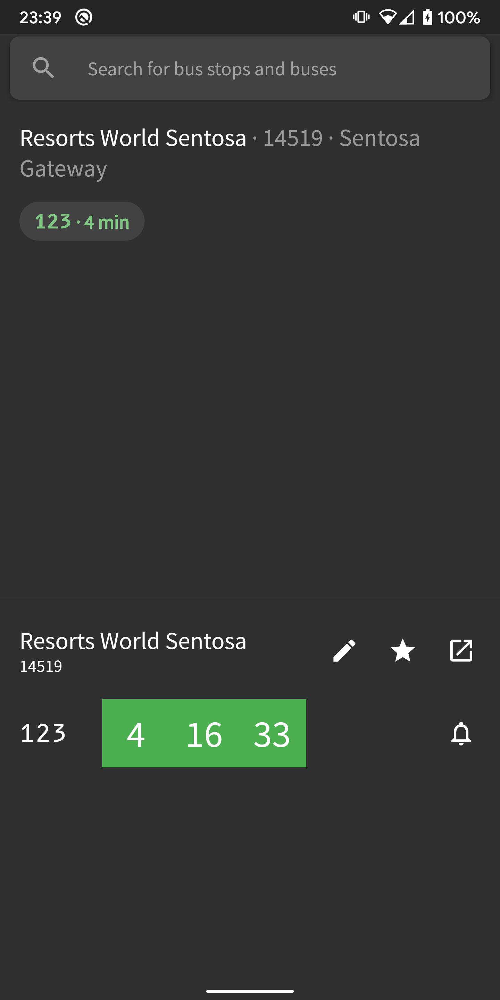
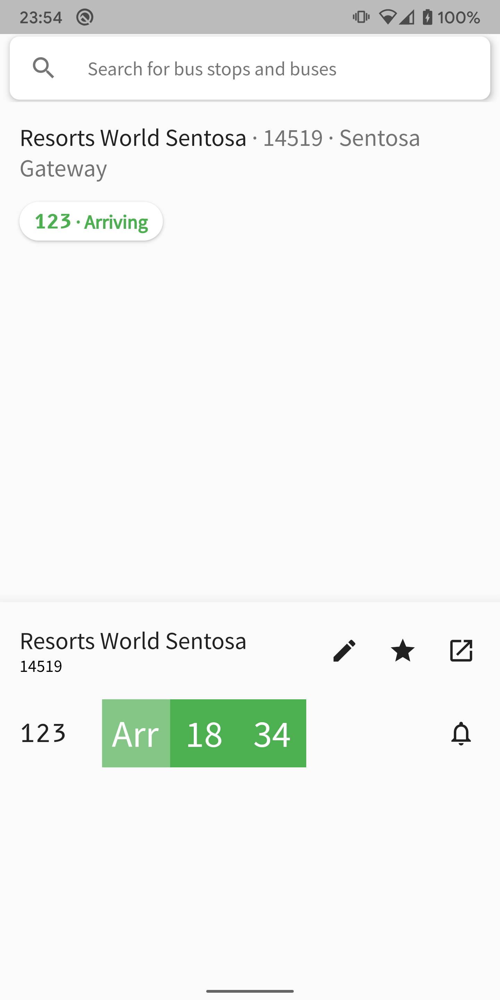

# Stops


Stops is an app built with Flutter that displays live bus timings for bus stops in Singapore.
It uses live data exposed by [LTA Datamall](https://www.mytransport.sg/content/mytransport/home/dataMall.html)'s API.

## Screenshots
| Homepage | Search page | Light mode |
|---------|---------|---------|
| |  | |

## Features
 - Set favorite bus stops by starring them
 - Search bus stops by their name or code
 - Get notified when bus is arriving soon
 - Automatic light/dark mode according to system-wide toggle
 

## Getting Started
 ```
 git clone https://github.com/jeffsieu/stops-flutter.git
 ```
 
### Setting API keys
Set your [Google Maps API key](https://console.cloud.google.com/google/maps-apis/overview) for Android at `stops_flutter/android/local.properties`.
 ```properties
...
googleMaps.apiKey=apikey
 ```

 
 For bus stop retrieval, set your [LTA API key](https://www.mytransport.sg/content/mytransport/home/dataMall/request-for-api.html) at `stops_flutter/assets/secrets.json`. 
 ```json
 {
     "lta_api_key": "apikey"
 }
 ```
 
## Built with
 - [Flutter](https://flutter.dev/) - The mobile-app framework used
 - [Rubber](https://github.com/mcrovero/rubber) - An awesome bottom-sheet implementation in Flutter

## Credits
This app is an experiment by Jeff Sieu.
